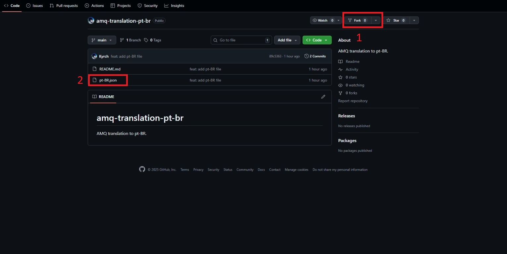
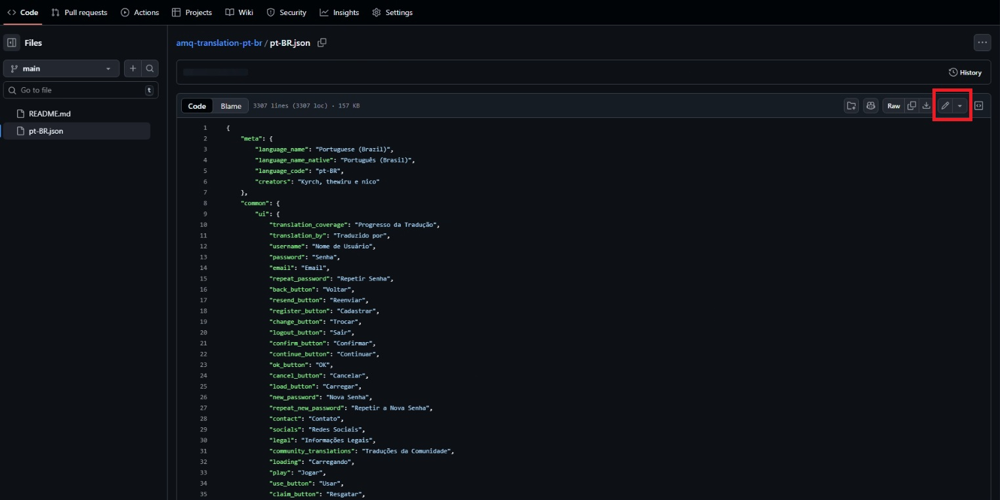
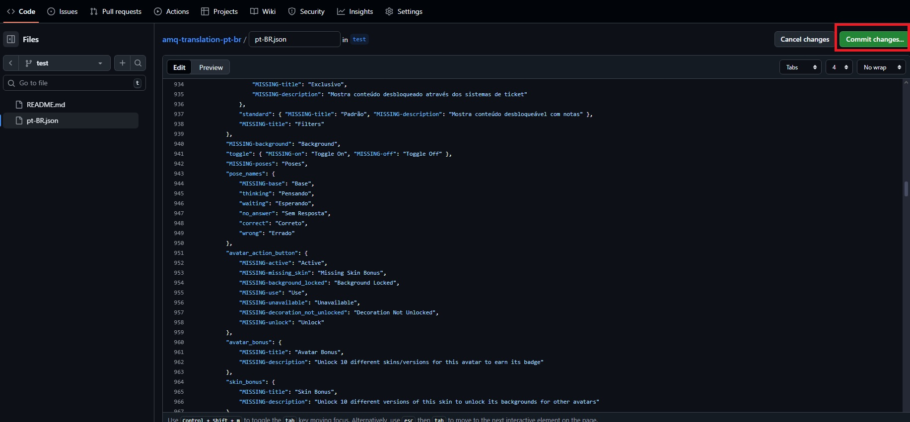
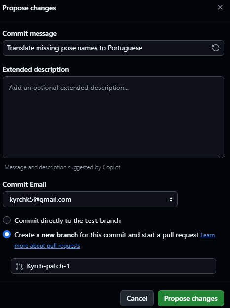
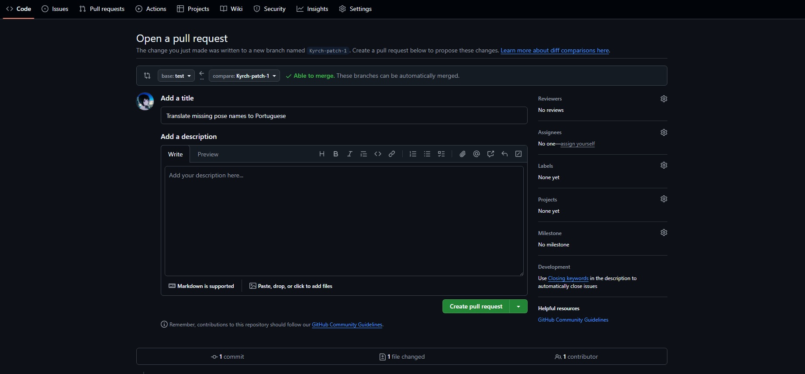

# amq-translation-pt-br

Brazilian Portuguese (pt-BR) translation for AMQ.

# Contributing

If you’re not familiar with GitHub, you can make your changes directly on GitHub’s website.
For that reason, this guide focuses on the web interface rather than the command-line approach.

1. First, fork this repository to your GitHub account.
After forking, navigate to the `pt-BR.json` file in your forked repository.

2. Click the **pencil icon** in the top-right corner to start editing the file.

3. Edit the translations as needed.
When finished, click “**Commit changes…**” in the top-right corner.

4. Write a clear commit message describing your changes.
Select “Create a new branch for this commit” if you haven’t already.
Click “Propose changes”.

5. Click “**Create Pull Request**” and wait for your changes to be reviewed and accepted.

